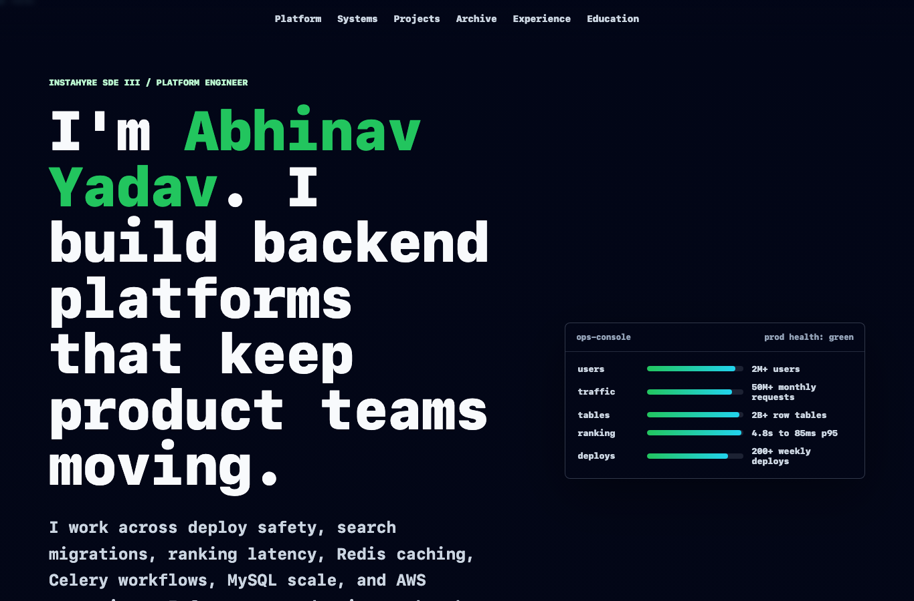

<div align="center">

# portifolio

**Personal website for [abhiyadav.in](https://abhiyadav.in) — animated single-page portfolio.**

[](https://abhiyadav.in)
[](https://github.com/abhinav-yadav-official/portifolio/releases)
[](LICENSE)
[]()

</div>



> The repository name `portifolio` is intentionally misspelled — it matches the canonical GitHub repo `abhinav-yadav-official/portifolio`.

## Overview

The live personal site at abhiyadav.in: a static single-page portfolio with an animated universe backdrop, project/experience sections, and full SEO/social metadata. No build step — ships as authored.

## Features

- **Animated landing** — universe-backdrop motion on the hero.
- **Single-page sections** — about, projects, experience, education.
- **SEO + social** — `sitemap.xml`, `robots.txt`, `og-image`, favicons.
- **Custom error pages** — 403 / 404 / 50x.
- **Resume** — linked PDF.

## Live Access

- Website: https://abhiyadav.in

## Installation

```sh
git clone https://github.com/abhinav-yadav-official/portifolio.git
cd portifolio
task test          # lint/validate — see Taskfile.yml
# or just open index.html in a browser
```

## Deploy

```sh
task deploy -- abhiyadav.in
```

The deploy preserves `/var/www/html/shared/` so the LeetDrill extension downloads served from the same host stay intact.

## License

[MIT](LICENSE) © 2026 Abhinav Yadav
